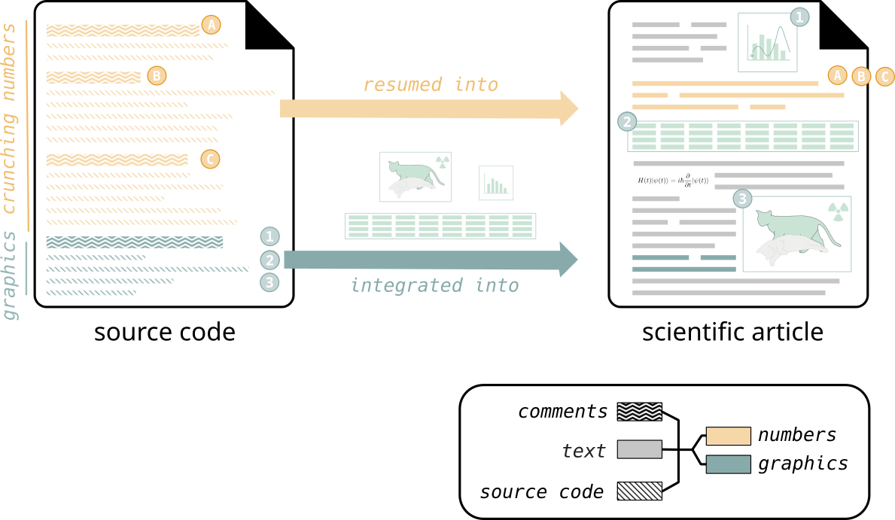
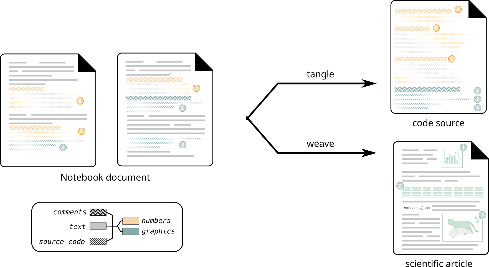

# Plan

- Introduction Literate Programming (LP) and Notebook(s)
- Challenging reproducibility ? (computational)
- Data relative accessibility and stability
- Example of practice
- Publishing (working paper, draft, preprint)

::: notes 

:::


## Literate programming

::: {.incremental}
- Code can be opaque: it's not always obvious what it does
- The _reasons_ why somebody wrote the code are not visible at all
- The _scientific context_ of a computation is not in the code either
:::

. . .

Donald Knuth's Knuth1984 proposal:
 [Literate Programming](https://doi.org/10.1093/comjnl/27.2.97) (1984) 

- Write a story explaining the code
- Insert the code as fragments into the story
- Make a tool that extracts the code fragments and puts them together correctly

## Literate programming 

Knuth practiced his technique:

 - two books ([TeX, Metafont](https://en.wikipedia.org/wiki/Computers_and_Typesetting))
 - many papers 

. . .


## Notebook anatomy  {background="#ffffff"}
 

::: moy
Without [*Literate programming*]{.orange}
:::

{width="100%"}

::: notes
In this slide we describe the classic way used by scientific for publication.

Source code at the left is made of both comments and source code.
One part of this code run and make computation (yellow) and the other generate graphics (green)

We resume the computation in some methodological paragraphs in article (yellow), pictures and explanation.

The fact is, source code and article are probably not synchronized, article doesn't reflect the real code and vice versa.
And, this is problematic, and when discover that this is a very common observation, even in computer science, we have a reproducibility crisis like recently.
Because scientific stop believing article with beautifull are sufficient.

:::

## Notebook anatomy  {background="#ffffff"}

::: moy
With [*Literate programming*]{.orange}
:::

{width="100%"}

::: notes
With LP and Notebook, we have everything in the same document, the source code that generate result, graphics, and explanation.
The organisation of source code in this document is made for human, for explanation.
Because, from human point of view, introducing B is a better way to explain the method than to introduce A first.

And with this single source of truth, we have a) the Tangle process which extract code for computer, and b) the Weave process that run code and generate the scientific article.
Everything is synchronized.
:::


## Notebook Zoo

::: {layout-ncol=3}

<div class="zoom">{width=100%}</div>

<div class="zoom">{width=100%}</div>


:::

## Reproducibility and replicability
_Reproducing:_ re-running a simulation or data analysis identically

 - be sure what was done _exactly_
 - establishing a baseline for experimentation

. . .

_Replicating:_ replacing pieces of code and/or data by something believed to be equivalent 

 - testing methods, code, and data for robustness
 - challenge your beliefs about equivalence


## Perspectives on data and code


- Data is about the world we study
- Data is collected, curated, cleaned, ... by scientists
- Computation makes output data from input data
- My input data is someone else's output data (and vice versa)
- Code is a tool

. . .


## Documenting provenance

Three kinds of data:

1. **Recorded observations:** record with metadata about provenance

2. **Choices made by humans:** keep under version control

3. **Computed results:** record inputs (with their provenance)


## From theory to practice

::: {.incremental}
- Some datasets are too big to be fully archived and versioned
- Much data (in particular code) is proprietary
- Different kinds of data are often entangled
- Almost all our software pre-dates reproducibility concerns
- The software industry doesn't care much about reproducibility
- Needs of API key

:::


## MyBinder

[](https://mybinder.org/v2/gh/C2DH/template_repo_JDH/main?filepath=article.ipynb)


Using Binder, it is possible to re-execute this notebook on a cloud resource. This can be tested by following this link:

- [At the root](https://mybinder.org/v2/gh/C2DH/template_repo_JDH/main) - Jupyter lab, can open files in this repository
- [The file](https://mybinder.org/v2/gh/C2DH/template_repo_JDH/main?filepath=article.ipynb) - Jupyter Lab, open notebook figure1.ipynb immediately


## Organization in a template repository

see [GitHub repo]https://mybinder.org/v2/gh/C2DH/template_repo_JDH

## Software dependencies and installation

Python, python virtual environment, dependencies

Given an installed Python3 interpreter (tested on python3.12.11), one needs to install the
packages listed in [`requirements.txt`](requirements.txt). 


For example:

```console
python3 -m venv venv             # create virtual environment
source venv/bin/activate         # activate virtual environment
pip install -r requirements.txt  # install dependencies
```

## Workflow to collaborate


